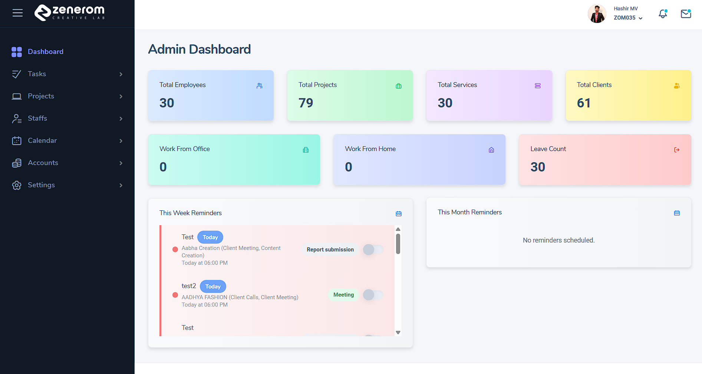
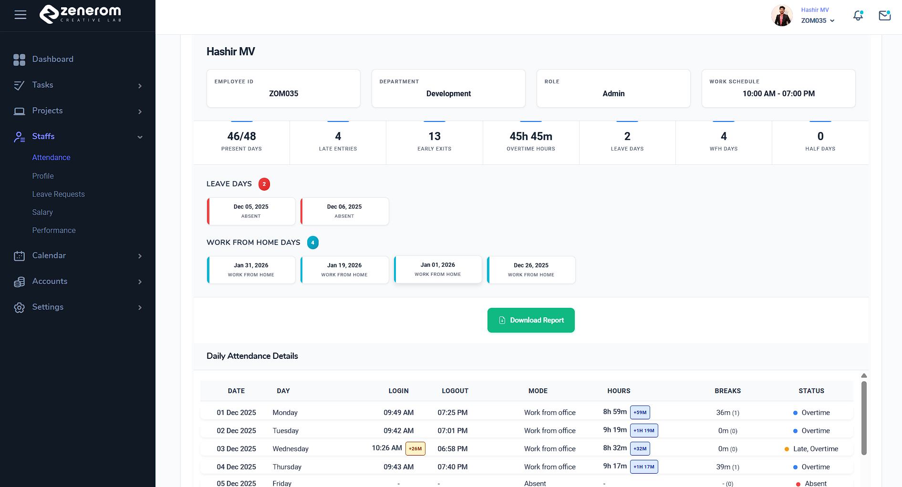
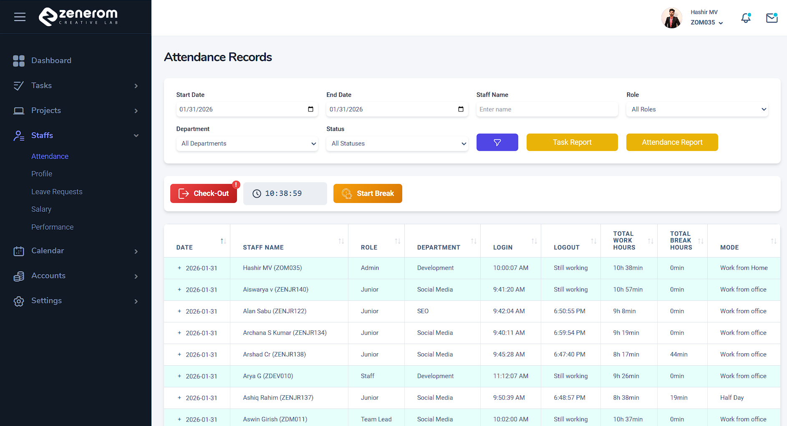
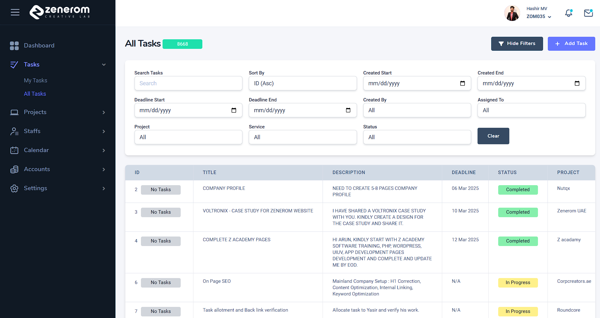
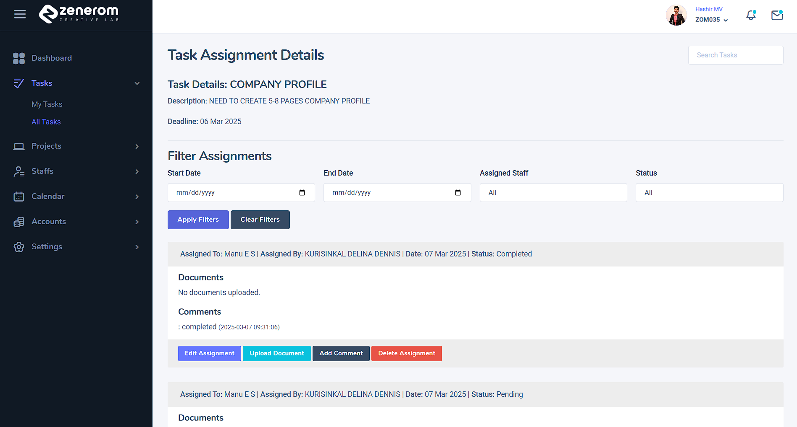

# HRM Software (Laravel + MySQL)

A role-based HRM web application built to manage employee data, attendance, leave, tasks, projects, reminders, and internal operations from a single dashboard.

## Tech Stack
- Backend: PHP (Laravel)
- Database: MySQL
- Frontend: Blade, HTML, CSS, JavaScript, Jquery Bootstrap.

## Key Features
- Authentication & role-based access control (Roles / Permissions)
- Employee management (Create, update, track employee profiles)
- Department management
- Attendance management
- Leave request workflow (Request, review, approve/reject)
- Tasks & team tasks tracking
- Project management
  - Projects
  - Project descriptions
  - Milestones
  - Updates
  - Project staff assignment
- Reminders & scheduled actions
- Notifications

## Screenshots

